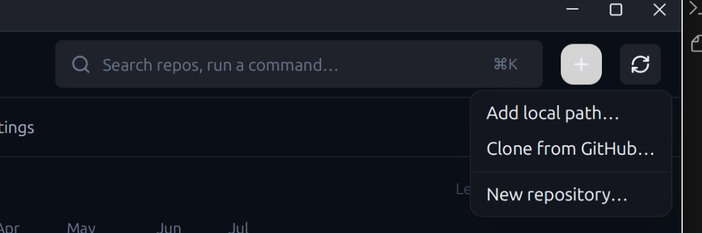
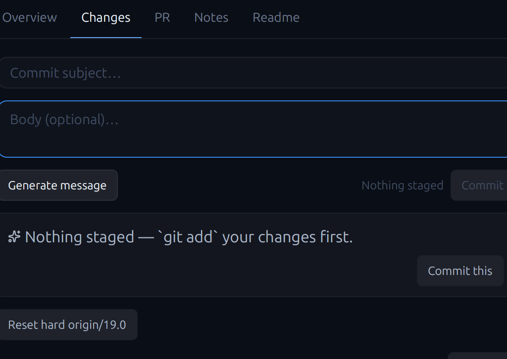
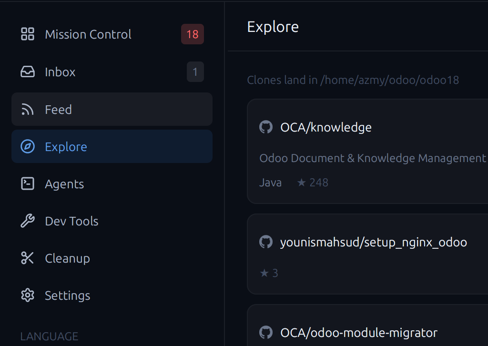
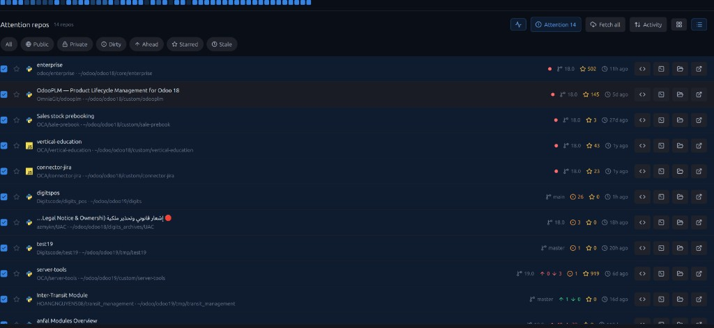

# Changelog

All notable changes to this fork of [Orrery](https://github.com/Hankanman/Orrery) are documented here.

The format follows [Keep a Changelog](https://keepachangelog.com/en/1.1.0/),
and this project (upstream) uses calendar versioning (`YYYY.M.P`).

## [Unreleased] — DigitsCode fork

Fork maintained for DigitsCode / Odoo multi-repo workflows (hundreds of checkouts
under `odoo18` / `odoo19`, nested submodule trees such as `manooshaalreef`).

### Added

- **Submodule discovery** — after scanning top-level checkouts, parse each
  parent’s `.gitmodules` and register checked-out submodules with `parent_id` /
  `submodule_path` (no deep WalkDir into every repo).
- **TREE sidebar** — expandable parent → submodule children under GROUPS;
  click parent to focus Mission Control on parent + children; children hidden
  from the flat grid by default (avoids duplicating shared modules × N).
- **Action filters** — Mission Control chips **Stageable** (`unstaged > 0`),
  **Commitable** (`dirty > 0`), **Pushable** (`ahead > 0`), with counts; TREE
  keeps a parent visible when a child matches the active filter.
- **Context menus** — right-click on repo cards, Mission Control **list** rows,
  and TREE rows: Open drawer, Stage all, Commit All…, Generate & commit
  (shown only when `aiReady`), Push, Fetch, Pull.
- **Fleet ops** — `FleetOp::StageAll` and `Push` for multi-select / selection bar.
- **Smart “+” add flow** — header **+** opens one modal with tabs: Add local
  path (single repo **or** scan folder), Clone from GitHub, New repository
  (shared `prepare_workspace_root` with Settings).
- **Commit All / Generate** in the Changes drawer from the full working tree
  (not staged-only), with clearer AI error toasts.
- **Top navigation tabs** — primary views (Mission Control, Inbox, Feed, …)
  moved to a horizontal tab bar under the header; left rail is context-only
  (GROUPS / TREE / ROOTS / LANGUAGES).
- **gpui-component icon assets** — register `gpui-component-assets` alongside
  Orrery’s lucide pack so TitleBar window controls and Button icons render.

### Changed

- **Header chrome contrast** — `+` is a single secondary (solid) chip (no
  dropdown; tabs live in the add modal); sidebar toggle and rescan sit on
  visible button backgrounds; TitleBar uses a lifted surface and bright
  foreground so minimize / maximize / close stay readable.
- **Deleted-file detection** — deeper watcher + status refresh so removals show
  reliably in Changes.
- **Repo name filter** — Mission Control toolbar query (`grid.query`) filters by
  name / slug / path.
- **Workspace groups** — GROUPS section with Fetch / Pull on the active group.

### Fixed

- Invisible **minimize / maximize / close** and header **+** when only Orrery
  lucide assets were registered (gpui-component `IconName` paths never loaded).
- Single-repo add path (e.g. `/home/azmy/Orrery`) without requiring a parent of
  many repos.

### Screenshots

| Surface | Shot |
|---------|------|
| Mission Control |  |
| Header: **+** chip + window controls (add entry is now a tabbed modal) |  |
| Changes / commit |  |
| Explore (Odoo workspace) |  |
| Attention list |  |
| Header before contrast fix (reference) |  |

---

## Upstream

For the original project’s release history, see
[Hankanman/Orrery](https://github.com/Hankanman/Orrery) tags and docs.
